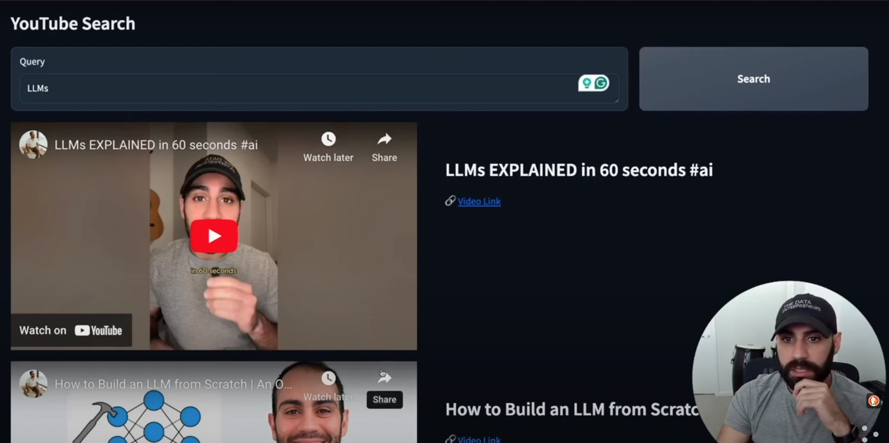
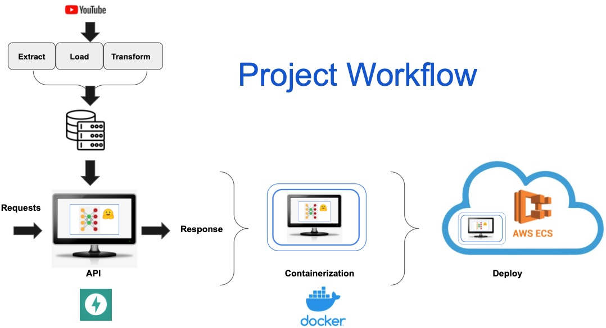

# Semantic Search Application - Solving the Problem of Increasing YouTube Viewer Engagement

<p>
  
</p>

<br>


[](https://github.com/beenlanced/python_project_semantic_search/actions/workflows/semantic_search_est.yml)

---

## Project Description

### Problem

YouTuber [Shaw Talebi](https://www.youtube.com/@ShawhinTalebi) puts out lots of YouTube video content covering a diverse range of topics, mostly data science videos, but also entrepreneurship guides, self-help videos, and general well-being videos. His viewers `have difficulties locating content` that aligns with their specific interests because one word tags of video content don't always capture the exact interest category and applying numerous tags only exacerbates the search issue by causing false reads.

### Why it needs to be addressed

This inability to find desired content means his channel gets lower engagement translating to stunted audience growth. His viewers may leave (bounce) from his channel or become so frustrated on missing out on content that they provide negative reviews. In short, he will lose out on YouTube revenue, miss out on potential “likes”, and waste time providing video content that viewers don't want or just can’t find.

### Proposed Solution

This project extends and expands on Shaw's `Full Stack Data Science` [project](https://www.youtube.com/watch?v=03x2oYg9oME&list=PLz-ep5RbHosWmAt-AMK0MBgh3GeSvbCmL&index=3).

It:

- scans Shaw’s YouTube channel to acquire video titles, ids, and transcripts to create a central searchable repository,

- uses AI/ML natural language processing (NLP) and Deep Learning techniques to translate user defined queries into the closest matches of related video content, and

- provides a FastAPI web application deployed locally and by an `Amazon Web Services - Elastic Container Service (AWS-ECS)` that allows his channel’s users to submit queries and retrieve links and playable videos of content from his YouTube channel that are similar to the query.

### Modeling Approach

<p>
  
</p>

---

## Objective

The project uses the well-known `source (SRC)` layout structure. It contains the key elements:

- `AWS-ECS`, Amazon Web Services - Elastic Cloud Service, runs virtual machine to render the semantic search web application supplied by building a Docker container from a deployed Docker image from Docker hub.
- `CI/CD` automated pipeline created using `GitHub Actions`,
- `Deep Learning` for neural network transformers,
- `Docker`. Application code is containerized so it can be deployed just as easily to a user's host machine or to the cloud. It uses a Dockerfile that employs a multi-stage docker build using `uv`,
- `Custom Exceptions` for when you want to create your own unique error messages,
- `FastAPI` web framework use to build APIs for this semantic search application,
- `Functional tests` and `unit tests` using `pytest`,
- `Git` (version control),
- `Github` with a pull request template like you might use at work,
- `Hugging Face` sentence transformer models to embed test files,
- `NLP` to translate user defined queries into the closest matches of related video content,
- `Type` hinting using `mypy` and `Pylance`,
- `Web application` using `FastAPI`,
- `uv` package management including use of `ruff` for linting and formatting, and
- `YouTube API` to access YouTube statistics and data for a specific YouTube channel.

---

## Tech Stack


---

## Project Structure

```
├── data
│   ├── all-MiniLM-L6-v2
│   ├── eval_raw.csv
│   ├── video_ids.csv
│   ├── video_ids.parquet
│   ├── video_index_full.parquet
│   ├── video_transcripts_full.parquet
│   ├── video_transcripts.csv
│   └── video_transcripts.parquet
├── Dockerfile
├── exceptions
│   └── custom_exceptions.py
├── imgs
│   ├── semantic_search_workflow.jpg
│   └── shaw_result.jpg
├── pyproject.toml
├── README.md
├── semantic_search_yt.egg-info
├── src
│   ├── app.py
│   ├── data_science
│   │   ├── create_video_index.ipynb
│   │   ├── develop_models.ipynb
│   │   └── execute_search_function.ipynb
│   ├── eda.ipynb
│   ├── functions.py
│   ├── get_video_data.py
│   ├── perform_data_ingestion.py
├── tests
│   ├── functional
│   │   └── test_api.py
│   ├── test_UI.ipynb
│   └── unit
│       └── test_return_search_result_indices.py
└── uv.lock
```

---

## Getting Started

Here are some instructions to help you set up this project locally.

---

## Installation Steps

### Option 1: Installation from Github with UV (recommended)

Here are the steps to install and set up a Github repository as a package/project directly from a `GitHub` repository using `uv`:

1. **Install uv**

   - If you haven't already, install uv. Several installation methods are available, including using a standalone installer or installing from PyPI with pipx or pip.

     - Using the standalone installer (example for macOS/Linux)

       ` curl -fsSL https://astral.sh/uv/install.sh | s`

   - Install from GitHub: Use `uv pip install` with the GitHub repository URL. The format is.

     `uv pip install git+https://github.com//<repo>.git`

   - To install a specific branch, tag, or commit, add `@<reference>` to the URL.

`uv pip install git+https://github.com/beenlanced/python_project_semantic_search.git@<branch_name>`

- Editable installs: For local development where you want changes in the repository to be immediately reflected, use the `-e` flag.

`uv pip install -e git+https://github.com/beenlanced/python_project_semantic_search.git`

- Specifying dependencies in pyproject.toml: You can also add the GitHub repository as a dependency in your pyproject.toml file.

  [tool.poetry.dependencies]
  your_package = { git = "https://github.com/beenlanced/python_project_semantic_search.git", rev = "<branch/tag/commit>" } # For Poetry

  [project.dependencies]
  your_package = { git = "https://github.com/beenlanced/python_project_semantic_search.git", ref = "<branch/tag/commit>" } # For setuptools/build

2. **Install Dependencies- with `uv` it is already done for you**

   - All dependencies should be specified in the **pyproject.toml** file, so you should not have to add any additional dependencies.
   - To update your projects virtual environment simply run  
      `uv pip sync`
     This will also activate your virtual environment (e.g., .venv folder) without requiring manual activation of the environment on your part with all the required packages as specified in the **pyproject.toml** file.

3. **Run the Project**

   - Start the project by running the appropriate command at the `src` directory
     ```
     uv run fastapi dev app.py
     ```
     or
     ```
     uv run fastapi dev src/app.py
     ```

4. **Access the Project's Web Interface **

   - Open a web browser with following url.
     - http://127.0.0.1:8000/search

5. You can test via a `Jupyter` notebook in the `test` directory. View that notebook for guidance on testing.

### Option 2: Installation from DockerHub

If you prefer to use Docker, you can install and run the project using a Docker container from an image from my DockerHub:

1. **Pull the Docker Image**

   - Open your terminal or command prompt.
   - Run the following command to pull the Docker image from DockerHub:
     ```
     docker pull ubeenlanced/semantic_search_app:latest
     ```

2. **Run the Docker Container**

   - Start the Docker container by running the following command. Adjust the port mapping as needed:
     ```
     docker run -d -p 80:80 --name yt_semantic_search_demo semantic_search_app
     ```
     This command launches the project within a Docker container.

3. **Access the Project**
   - Open a web browser or the appropriate client to access the project.
     - http://0.0.0.0:80/search # Note this url is different than one used when running the code using `uv run fastapi dev app.py`.

---

## Special Notes

1. **Key variabless you must specify**

   - `API_URL`="https://www.googleapis.com/youtube/v3/search"

     - Publically available API from YouTube

   - `CHANNEL_ID`="UCa9gErQ9AE5jT2DZLjXBIdA"

     - Channel ID of Shaw Talebi's YouTube channel

   - `MY_YOUTUBE_API_KEY`="GET YOUR OWN YOUTUBE API KEY"
     - [link](https://www.youtube.com/watch?v=LLAZUTbc97I&t=48s) to explain how to get your person YouTube API key

2. **Sentence transformer models**

   - Three sentence transfomer models were evaluated:

     - all-MiniLM-L6-v2
     - multi-qa-distilbert-cos-v1
     - multi-qa-mpnet-base-dot-v1

   - The best embedding method overall was `all-MiniLM-L6-v2_title_transcript_manhattan` for this project because:

     - all-MiniLM-L6-v2 is the most compact transformer and provides computational efficiency.

     - it ranked high across all evaluation metrics (see eda notebooks)

     - It utilizes both titles and transcripts

   - We include the `all-MiniLM-L6-v2` sentence transformer model code for the containerized solution as it is the ML/AI model being used and would get passed into code.

     downloaded from:
     https://github.com/henrytanner52/all-MiniLM-L6-v2

3. **Created final data store using the winning method**

   `video_index_full.parquet`:
   This file will be the final data store used for production systems. Essentially, the data that get's stored in the cloud and/or used for production purposes

4. **ignore this warning message**

   I ignore warning message below during testing and running the code.

   ```
   PerformanceWarning: Determining the column names of a LazyFrame requires resolving its schema, which is a potentially expensive operation. Use `LazyFrame.collect_schema().names()` to get the column names without this warning.
       dist_arr = dist.pairwise(df.select(df.columns[4:388]).collect(), query_embedding) + dist.pairwise(df.select(df.columns[388:]).collect(), query_embedding)
   ```

   The code works fine and making the suggested change will break the code. There is already a reported [bug: use LazyFrame.collect_schema().names() over LazyFrame.columns #1744](https://github.com/unionai-oss/pandera/issues/1744) for this issue and the recommendation is to not use the suggested change in the warning message.

5. **To create your own AWS-ECS account**

   [AWS-ECS Free Tier](https://aws.amazon.com/free/?all-free-tier.sort-by=item.additionalFields.SortRank&all-free-tier.sort-order=asc&awsf.Free%20Tier%20Types=*all&awsf.Free%20Tier%20Categories=*all)

   From within your account and once you get a service up and running, you will need to load the semantic search app image: `ubeenlanced/semantic_search_app:latest` from Dockerhub to create a container that will run the app.

   - Within your AWA cluster/service setup, under Networking tabs make sure to create a new `inbound traffic rule`
     - set `types` to `all` types of traffic and
     - set `source` to `My IP`
       - this will help allow access to the running services public IP address for the ECS service running the semantic search application.

6.**Avoiding Github Actions workflow causing GitHub to run out of memory space**

When dealing with Deep Learning Models, it is possible to exhaust the allotted GitHub memory space when running GitHub actions to build Docker images and to test AI/ML models. A way to mitigate the space issue is to remove unnecessary files created in your workflow.

[reference](https://github.com/orgs/community/discussions/25678)

In workflows, add the following code in `steps` section to free up space by removing unnecessary files (see my `semantic_search_test.yml`):

```
steps:
     # Step 0: Free up space to avoid no space left on device
     - name: Delete huge unnecessary tools folder
       run: rm -rf /opt/hostedtoolcache
```

---

## Review the Source Code

Have a look at the various directories, modules, and other files for examples of how to perform testing, set up Dockerfiles, etc.
The project is full of insights.

---

### Final Words

Thanks for visting.

Give the project a star (⭐) if you liked it or if it was helpful to you!

You've `beenlanced`! 😉

---

## Acknowledgements

I would like to extend my gratitude to all the individuals and organizations who helped in the development and success of this project. Your support, whether through contributions, inspiration, or encouragement, have been invaluable. Thank you.

Specifically, I would like to acknowledge:

- [Shaw Talebi](https://www.youtube.com/@ShawhinTalebi) for the inspiration and coding guidance for parts of this project. This project is an extension of his initial work.

- [Hema Kalyan Murapaka](https://www.linkedin.com/in/hemakalyan) and [Benito Martin](https://martindatasol.com/blog) for sharing their README.md templates upon which I have derieved my README.md.

- The folks at Astral for their UV [documentation](https://docs.astral.sh/uv/)

---

## License

This project is licensed under the MIT License - see the [LICENSE](./LICENSE) file for details
